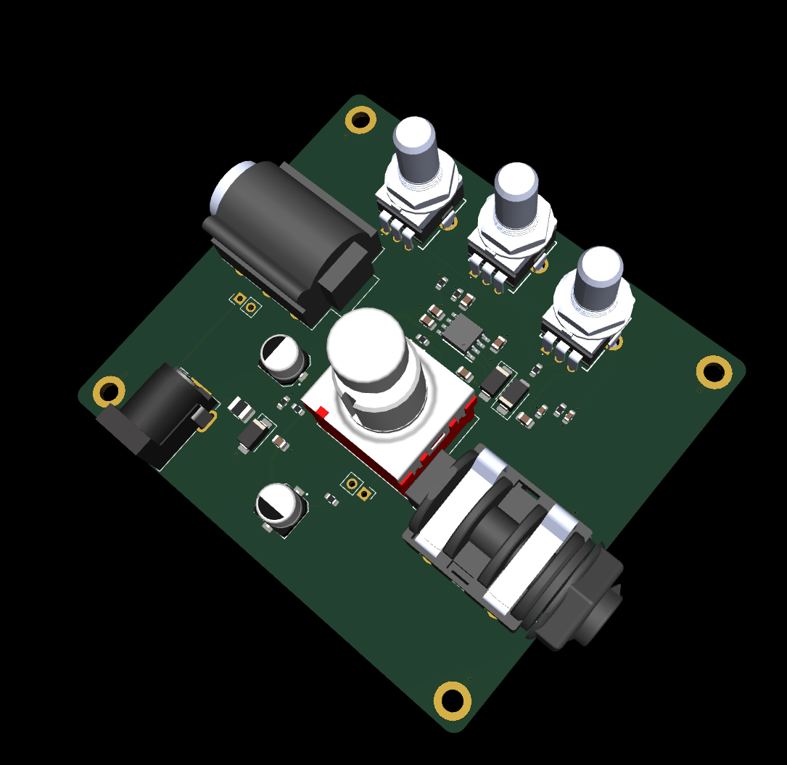

# SCREAM_BEAN_REV_B

  

Project Status

This revision is intended to improve the original SCREAM_BEAN layout and move the board closer to a clean, buildable pedal PCB.

System Role

Guitar input
    ↓
input buffer / gain and clipping stages
    ↓
tone / level shaping
    ↓
output to amplifier or next pedal

Key Specs

Board role - Analog guitar drive/distortion pedal PCB
Revision - Rev B
Circuit style - Tube Screamer-inspired overdrive/distortion
Sound target - Early-2000s pop-punk drive
Power direction - 9V pedal supply / battery-style pedal ecosystem
Controls - Drive / tone / level style pedal controls
Audio path - Analog
Board type - Stompbox effects pedal PCB

Main Features

Analog guitar input/output signal path
Drive/clipping stage
Tone-shaping network
Output level control
Pedal-style power input direction
Compact board layout for enclosure use
Silkscreen labels for bring-up and assembly
Revision B layout improvements

SCREAM_BEAN_REV_B is inspired by the Tube Screamer topology, but it is not meant to be a component-perfect clone.

Design priorities:

Build a working analog drive circuit
Learn op-amp gain/clipping behavior
Shape the tone for pop-punk rhythm guitar
Keep the board understandable and buildable
Use layout practices that make audio debugging easier

Power Notes

Pedal power should be treated carefully.

pedal supply / battery input
        ↓
protection / filtering
        ↓
audio circuit power rail

Common first checks:
no sound      → check power, input/output jack wiring, IC orientation
weak sound    → check gain stage values and pot wiring
harsh/fizzy   → check clipping diode orientation and tone network
hum/noise     → check grounding and cable/enclosure wiring
oscillation   → check layout, power decoupling, and high-gain routing

Design Notes
Keep audio input routing away from noisy power routing.
Keep gain-stage feedback paths short.
Keep power decoupling close to the IC.
Use clear labels for pots, jacks, power, and switch wiring.
Confirm enclosure fit before ordering a panelized or final version.
Expect component value experiments while tuning the sound.

Repository Output Images

Expected image paths for GitHub README rendering:

Outputs/
  IMG/
    3D-T.png
    3D-B.png
    SCHEMATIC.png
    L1-SIG.png
    L2-GND.png

Safety / Design Note

Designed & engineered by Brandon Shelly